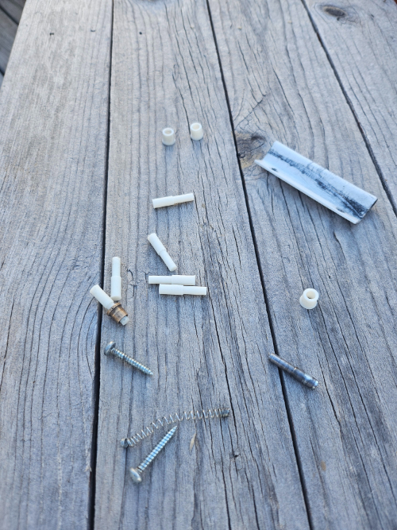
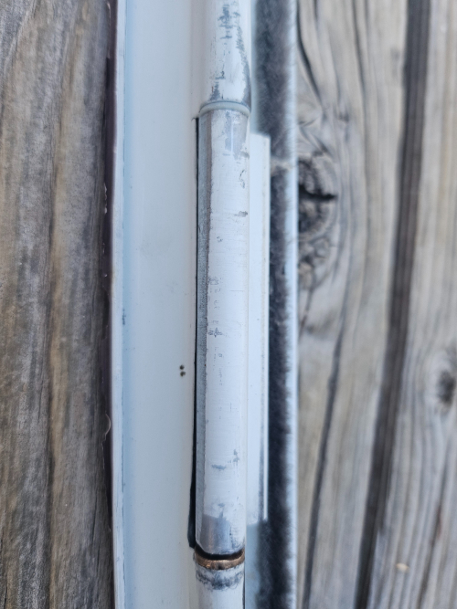

# 🚪 Storm Door Hinge Pin Fix

This is a quick repair project that saved me from overpaying for a minor part and waiting on shipping in the middle of a storm-prone season.

## 🧩 The Problem

Our storm door hinge pin cracked during a week of particularly nasty weather. We get straight-line winds in the 70+ mph range, so a working storm door isn’t just about convenience—it’s about keeping the door on the house.

The cheapest replacement hinge pin kit I could find locally was $35. There was a cheaper ABS universal kit online, but it was out of stock. I had resin and a printer. That meant I had options.

  
	> The batch of pins and spacer curing in the sunlight.

## 🔧 The Fix

I pulled the broken part, measured carefully, and recreated the geometry in FreeCAD. It took a couple of attempts to get the tolerances right, but once dialed in, it worked beautifully.

I opted for shorter curing times than recommended to prevent the pin from becoming brittle under pressure—just like in my earlier **Tailgate Clip Fix** project. Once installed, the door closed smoothly again, and it’s still holding strong.

  
	> The hinge is installed with the original pin and my replacement.

## 📁 Files Included

- `StormDoorHinges.FCStd` – FreeCAD project file  
- `HingePin (Meshed).stl, HingPinSpacer (Meshed).stl` – Mesh files for 3D printing  
- `images/` – Before/after photos of the door and printed pin  

> 💡 *When a $0.50 part becomes a $35 kit, it’s time to print your own.*

---

If your storm door uses the same style of hinge pin and you’ve got a printer handy, feel free to try this out. Adjustments may be needed for slightly different makes and models.
