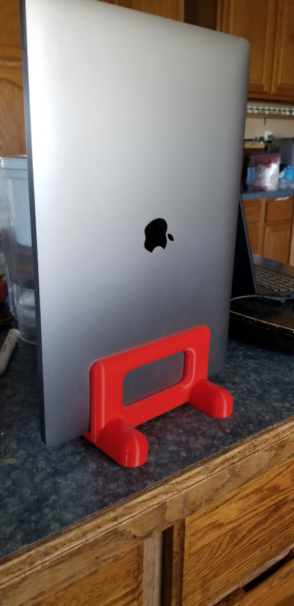
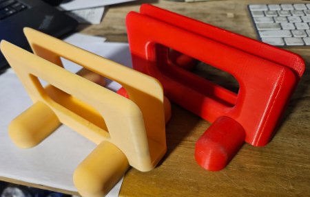

# Laptop Stand: From Basic and Rough to Parametric  

This project showcases the evolution of a vertical laptop stand—from a functional original design to a cleaner, fully parametric version optimized for customization and reuse.

## Problem

My workspace was getting crowded.

With my personal laptop docked on one end of the desk and a professional machine needing a home, I was out of room. Two keyboards, a USB-C hub, and other essentials left me with no space to work comfortably—until I noticed the unused space *behind* my monitors.

## Constraints

I needed a solution that was:

- Stable enough for everyday use
- Printable without supports
- Space-efficient, especially in depth
- Easy to modify for other laptops or devices
- Lightweight but strong enough for a MacBook Pro

## Approach

I started with a simple design to validate the concept, then rebuilt it as a parametric model using **FreeCAD**, allowing quick adjustments to height, width, thickness, and foot angle.

---

> 🏷️ STL and FreeCAD files are included for both versions. The parametric v2 version is easier to customize and remix. 

---

## 🧠 Evolution: From Working Concept to Structured Design

### 🪛 Original Model (v1)
- Multi-body FreeCAD design with nested Boolean operations and repeated fillets
- No spreadsheet linkage; editing dimensions meant hand-tweaking multiple sketches
- Worked well physically, but became difficult to maintain or modify
- Built quickly to solve a desk clutter problem with minimal iteration control

📁 Files: [`v1-original/`](./v1-original)
- [`Laptop_Stand_v1.FCStd`](./v1-original/Laptop_Stand_v1.FCStd)
- [`Laptop_Stand_Body_v1.stl`](./v1-original/Laptop_Stand_Body_v1.stl)
- [`Laptop_Stand_Foot_v1.stl`](./v1-original/Laptop_Stand_Foot_v1.stl)

---

### 🔁 Reworked Model (v2)
- Fully parametric: driven by a `Dimensions` spreadsheet
- Stand geometry and foot modules are cleanly separated
- Sketches are logically constrained and easier to modify
- Only one non-parametric fillet (post-cut) due to FreeCAD v0.20 limitations
- Modeled primarily on a Raspberry Pi 4 using FreeCAD 0.20.2 over VNC, mostly to see if I could

📁 Files: [`v2-parametric/`](./v2-parametric)
- [`laptop_stand_v2.FCStd`](./v2-parametric/laptop_stand_v2.FCStd)
- [`Laptop_Stand_Body_v2.stl`](./v2-parametric/Laptop_Stand_Body_v2.stl)
- [`Laptop_Stand_Foot_v2.stl`](./v2-parametric/Laptop_Stand_Foot_v2.stl)

---

## 🖼️ Gallery

| MacBook Pro | Chromebook | Both Stands |
|-------------|------------|--------------|
|  |  |  |

---

## 📐 Parametric Inputs

Defined in the `Dimensions` spreadsheet in `laptop_stand_v2.FCStd`:

- `stand_width`
- `stand_height`
- `base_slot_width`
- `stand_thickness`
- `fillet_radius` (auto-calculated from wall thickness)

Note: Post-cut fillet on the main stand body is applied manually via the **Part** workbench.

---

## 🖨️ Printing Notes

| Feature         | Recommendation                     |
|----------------|-------------------------------------|
| Material        | PLA or PETG or ABS like resin      |
| Orientation     | Rails down (stand); flat (feet)    |
| Infill          | 15–20%                             |
| Supports        | Only inside the cutout             |
| Assembly        | Print two `Foot` models (identical) |

---

## 🏷️ License

MIT License – remix, print, or adapt freely. A nod of credit is appreciated if you share or build upon this design.

---

## 🐧 Maker Note

This design was modeled and exported almost entirely on a **Raspberry Pi 4** running FreeCAD 0.20.2, proving that practical CAD doesn't require high-end hardware.
