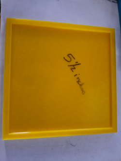

# Quilting Templates – Custom, Durable, Safer

My wife is an avid quilter who often needs precise tracing and cutting templates for repeated patterns. Many of the commercial options she tried wore out quickly or didn't quite match the sizes she needed. Worse, some of them were thin enough that a rotary cutter could easily slip and result in cuts, both on the fabric and fingers.

So we fixed that.

## 🧵 The Problem
- Commercial quilting templates wore out after moderate use.
- Thin, flat templates offered no finger protection during rotary cutting.
- Some desired shapes or sizes weren’t available off-the-shelf.
- Even ‘universal’ templates didn’t always meet project needs.

## 🛠 The Solution
I designed these templates in **FreeCAD** (some may have been quickly prototyped in Windows 3D Builder) and printed them with slight raised edges to guide the cutter and protect fingertips.

### Benefits:
- **Raised ridges** for safer rotary cutting.
- **Thicker plastic** for durability and reuse.
- **Custom sizing** for those just-out-of-spec pattern needs.
- **Quick turnaround** – from idea to working template in hours.

## 📁 What’s Included

Each file below is an STL template suitable for 3D printing and tracing or cutting. Print settings may vary, but we’ve found a layer height of 0.2 mm and 20–40% infill yields good results.

### 🔷 Triangles
[2.5 Inch Triangle Dice Tracing Template](meshes/2.5inTriangleDiceTracingTemplateCutout.stl)
[5 Inch Triangle Dice Cutout](meshes/5inTriangleDiceTemplateCutout.stl)
[4 Inch Triange Dice Cutout](meshes/4inTriangleDiceTracingTemplateCutout.stl)
[4.375 Inch Triangle Dice Cutout](meshes/4.375inTriangleDiceTemplateCutout.stl)
[5 Inch Square](meshes/5inTriangleDiceTemplateCutout.stl)

### ◼ Squares
[3 Inch Square](meshes/3inSquareTemplateCutout.stl)
[4 Inch Square](meshes/4inSquareTemplateCutout.stl)

### ⬟ Pentagons
[Pentagon Dice Cutting Template](meshes/PentagonDiceTemplateCutout.stl)
[Pentagon Dice Tracing Template](meshes/PentagonDiceTracingTemplateCutout.stl)

### 💠 Diamonds

## 📸 Photos

## 🤝 Licensing
Free to use, remix, and share with attribution. These were created to solve a household problem, and we hope they help others as well.

---

Designed with love and practicality.
