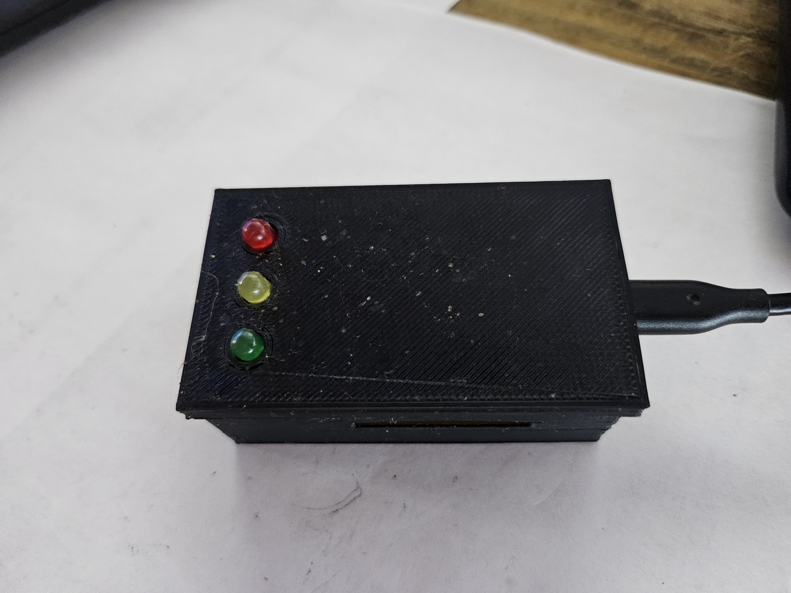
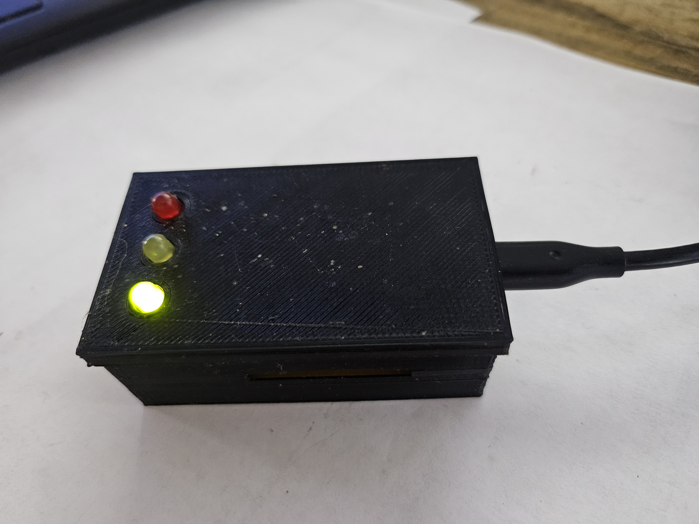

# Stoplight Status Indicator

A lightweight home-built status light system, designed to signal whether it's a good time to interrupt me during remote work. Originally created in 2018, it's been running nearly continuously ever since with very few changes.  

This project combines:
- 🧠 Simple logic (UDP broadcast + MicroPython LED controller)
- 🔧 Old-school tinkering (soldering, perfboard, CAT6 wiring)
- 🖥️ A desktop GUI for sending status signals
- 🧰 3D-printed enclosures and component design
- 💡 A clear use case: preventing awkward kitchen drive-bys during meetings

## 🧭 Why I Built It

In 2018, I began working remotely. It was fantastic—until it wasn’t. People at home couldn’t tell when I was in a meeting, on a call, or deep in thought. I tried a whiteboard on the office door. I tried notes. I tried polite signs. None worked.

I’d just bought a QIDI X-Maker 3D printer, and I remembered working with Phidgets years prior while supporting a Homeland Security project. I figured: how hard could it be to build a homegrown “status light”?

It turns out—not that hard. And strangely satisfying.

## 🛠️ What It Does

It’s a traffic light-style visual indicator using red, yellow, and green LEDs. From a small Python GUI on my desktop, I can send a signal to a microcontroller over my home network via UDP. The signal tells the microcontroller to light up the appropriate LED.

I keep one unit mounted inside my office door and another on a cabinet visible from the kitchen. It lets others know at a glance whether it’s okay to knock or not.

## 🧑‍🔬 What’s Inside

### Hardware
- NodeMCU ESP8266 board
- 3x standard 5mm LEDs (green/yellow/red)
- Resistors, jumper wires, perfboard
- Soldered DIP headers
- USB power
- Custom 3D-printed enclosure with mounting tabs
- Repurposed CAT6 cable for LED connections

### Software
- MicroPython script on the ESP8266 that listens for UDP packets
- Desktop Python GUI written with `tkinter` that sends status messages over the network

### Network Protocol
- Simple UDP broadcast with short payloads like `GREEN`, `YELLOW`, `RED`
- Chosen for simplicity and low overhead on a home network
- No pairing, no authentication, just a shout into the ether

## 📷 Project Gallery

| Stage | Photos |
|-------|--------|
| Schematic View |  |
| Underside Wiring |  |
| Early Assembly |  |
| Lit + Lid Open |  |
| Closed & Mounted |  |
| In Operation |  |

## ✍️ Lessons Learned

I was new to MicroPython and 3D design at the time, so this project taught me a lot:
- Debugging UDP behavior on a flaky home router
- Writing cross-platform Python GUIs
- Building semi-durable solder joints
- Designing tight enclosures that don’t crush wires
- Making projects that *look* finished enough to pass the spouse approval test

## 🤔 What I’d Do Differently Today

- Use MQTT instead of UDP for more structured messaging and easier expansion
- Replace perfboard with a printed PCB
- Design an enclosure that looks like an actual miniature traffic light (why not?)
- Add button cycling on the device itself as backup
- Possibly add an OLED display for status messages

## 🗂️ Project Structure

