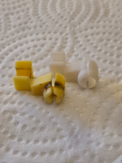

# Tailgate Push Rod Clip – 2000 Ford Ranger
  
When the tailgate on my son's 2000 Ford Ranger stopped working, I figured it would be an easy fix. I'd replaced plenty of tailgate hardware before. A quick trip to the auto parts store got me a pack of "universal" push rod clips—and within minutes I had the tailgate panel open and ready.

One of the clips snapped immediately (too small, my fault for forcing it). The only other one that *kind of* fit held for a bit, but didn’t survive more than a couple uses. None of the off-the-shelf parts actually worked. Even one "guaranteed to fit" failed.

After thinking it over, I remembered I had a 3D printer. Thirty minutes of careful measuring (and more FreeCAD tweaking than I’d like to admit) got me a printable model. Four iterations later, I had a part that fit well. But after curing it for the recommended 5 minutes, it turned out too brittle and cracked on install.

The breakthrough? I reduced the curing time to 2.5 minutes—just enough to set the resin without making it fragile. The part held perfectly. Ten months later, the tailgate still works like a champ.

If you’ve got an early 2000s Ranger with a broken push rod clip, feel free to use or remix the files below.

## 📁 Files Included

- [FreeCAD latch pattern](designs/tailgate_latch_v2.FCStd) – FreeCAD source file  
- [Printable Mesh](designs/tailgate_latch.stl) – Mesh file for printing  
- `images/` – Side by side images with production clip  

> *Sometimes the best fix isn’t on the shelf—it’s on the print bed.*
